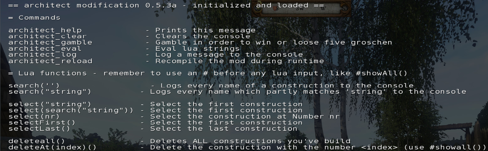
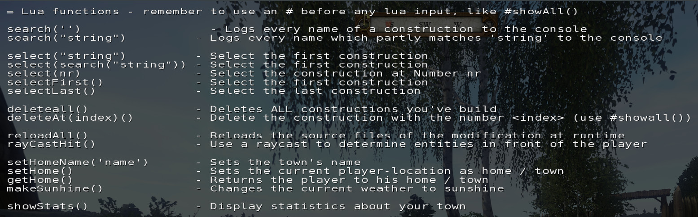
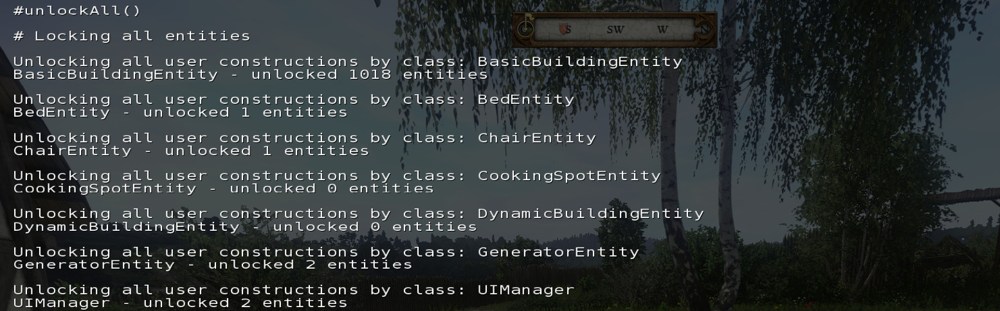
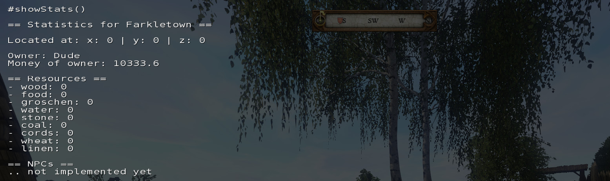
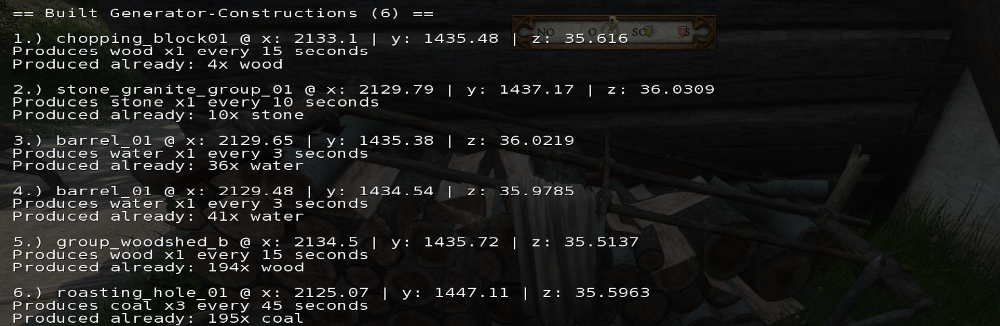

---
# index markdown file - main content
layout: default
---
# Welcome!
This project introduces new features and mechanics to [kingdom come deliverance](https://www.kingdomcomerpg.com/) like a construction-system,
a resource-system, a basic crafting-system, town management, etc. 

This means that the player can create and spawn constructions - this ranges from simple props to flora & fauna, 
vegetation, houses, walls, towers, tents, chairs, benches, beds, etc. almost anywhere in the world. Its also possible to build 
custom constructions like wood-, stone-, coal-, ... -generators which produce resources or items over time.

##### If you enjoy this mod send me your [screenshots / videos](https://www.nexusmods.com/kingdomcomedeliverance/mods/958?tab=images) or maybe [buy me a cup of coffee](https://www.paypal.com/cgi-bin/webscr?cmd=_s-xclick&hosted_button_id=PMULUFGTQFAJA&source=url) - thanks to all of you! 

 

**Note**  
Make a backup of your saved games - there is no new save required.  
There are no DLCs required to use this mod.

##### Thanks to [Warhorse Studios](https://warhorsestudios.cz) for developing and realizing this beautiful game and the modding sdk!

 

## News 
- Version 0.5.5a-test has been [released!](https://www.nexusmods.com/kingdomcomedeliverance/mods/958)
- Version 0.5.4a-test has been [released!](https://www.nexusmods.com/kingdomcomedeliverance/mods/958)
- [Sexy Biscuit](https://www.youtube.com/channel/UCvpxkCUky0wN5e0DNf_YZCQ) has released a new video which reviews the latest features of the architect on [YouTube](https://www.youtube.com/watch?v=f_x-3SbbOfc)
- Version 0.5.4a has been [released!](https://www.nexusmods.com/kingdomcomedeliverance/mods/958)
- Version 0.5.3b has been [released!](https://www.nexusmods.com/kingdomcomedeliverance/mods/958)
- Version 0.5.3a has been [released!](https://www.nexusmods.com/kingdomcomedeliverance/mods/958)
- [Sexy Biscuit](https://www.youtube.com/channel/UCvpxkCUky0wN5e0DNf_YZCQ) has released a two hour stream about town building and using architect on [YouTube](https://www.youtube.com/watch?v=tZISnQW5ms4)
- Version 0.5.2b has been [released!](https://www.nexusmods.com/kingdomcomedeliverance/mods/958)
- [Sexy Biscuit](https://www.youtube.com/channel/UCvpxkCUky0wN5e0DNf_YZCQ) has released another great gameplay video using the architect modification on [YouTube](https://www.youtube.com/watch?v=ysLVzh89N_c)
- [Sexy Biscuit](https://www.youtube.com/channel/UCvpxkCUky0wN5e0DNf_YZCQ) has released an overview on how to install and use the architect modification on [YouTube](https://www.youtube.com/watch?v=0D_I73Jn3G8)
- The german computer magazine [Gamestar](www.gamestar.de/) wrote an article about the [architect!](https://www.gamestar.de/artikel/mod-kingdom-come-eigenen-doerfer-burgen-bauen,3355483.html)
- Version 0.51a has been [released!](https://www.nexusmods.com/kingdomcomedeliverance/mods/958)

 

## Media 
Take a look at the base building videos of [sexybiscuit](https://www.youtube.com/channel/UCvpxkCUky0wN5e0DNf_YZCQ) to get an idea and how to install and use the modification - p.s. the videos are great!  

<iframe class="p-1" width="48%" height="480" src="https://www.youtube.com/embed/f_x-3SbbOfc" frameborder="0" 
allow="accelerometer; autoplay; encrypted-media; gyroscope; picture-in-picture" allowfullscreen></iframe>

<iframe class="p-1" width="48%" height="480" src="https://www.youtube.com/embed/gDjDkfh75nU" frameborder="0" 
allow="accelerometer; autoplay; encrypted-media; gyroscope; picture-in-picture" allowfullscreen></iframe>

<iframe class="p-1" alt="base building video by sexy biscuit" width="48%" height="480" src="https://www.youtube.com/embed/90tNln4SM5w" frameborder="0" allow="accelerometer; 
autoplay; encrypted-media; gyroscope; picture-in-picture" allowfullscreen></iframe>

<iframe class="p-1" alt="base building video by sexy biscuit" width="48%" height="480" src="https://www.youtube.com/embed/0D_I73Jn3G8" frameborder="0" allow="accelerometer;
 autoplay; encrypted-media; gyroscope; picture-in-picture" allowfullscreen></iframe>

<iframe class="p-1" alt="base building video by sexy biscuit" width="48%" height="480" src="https://www.youtube.com/embed/tZISnQW5ms4" frameborder="0" allow="accelerometer; 
autoplay; encrypted-media; gyroscope; picture-in-picture" allowfullscreen></iframe>

<iframe class="p-1" alt="base building video by sexy biscuit" width="48%" height="480" src="https://www.youtube.com/embed/ysLVzh89N_c" frameborder="0" allow="accelerometer; 
autoplay; encrypted-media; gyroscope; picture-in-picture" allowfullscreen></iframe>

 

## Installation
Get the latest release from [mods nexus](https://www.nexusmods.com/kingdomcomedeliverance/mods/958) or [github](https://github.com/benjaminfoo/Architect/releases), 
unzip the archive into your _'KingdomComeDeliverance\mods'_ - folder.  
If the installation was succesful you'll see the instructions-message on how to use the mod when the game has been started  
(and a savegame loaded or a new game hast been created).  

###  Using the devmode
You need to start the game with devmode enabled (the modification won't work otherwise).   
**In your OS / explorer / shell:**  
`<Steam>\steamapps\common\KingdomComeDeliverance\Bin\Win64\KingdomCome.exe -devmode`
  
### For Steam Users
The following list of files needed to be stored at:  
`Steam\steamapps\common\KingdomComeDeliverance\mods\architect\` 
- mod.manifest
- keybinds.cfg
- Data\architect.pak

### Other
As Im using the steam version I cant provide any details on using how to install and use the mod on the Epic Store or GoG -   
however, take a look at the nexusmods page because many users reported to get the modification to work. See this [link](https://www.nexusmods.com/kingdomcomedeliverance/mods/958?tab=posts).

### Uninstall / Removal
Its also safe to remove the mod at any time (if you've already created something within the game, without
deleting it first, the entity stays in the game. Use **#deleteall()** within the ingame-console to clean up your scene.)

 

## Usage / Keys
These keys can be used to interact with the mod - they're also shown ingame.

Choose the next construction
Button MouseWheel up  

Choose the previous construction
Button MouseWheel down  

Create a new construction  
Key V

Toggle rotation-mode for new construction
Key R
                
Remove a construction  
Key G

Enable / Disable the modification  
Key H

 

#### Change default key-bindings
The `keybinds.cfg` file contains all keybindings used in the project - change it to a key or a controller button as you like.

#### Add new constructions to the selection, remove constructions
Not every asset is referenced in the project, because some are not suitable (split into multiple parts which would be a 
pain to position by hand, some are graphical effects, some are too large to be positioned by the player, etc.).

However, one could add models / cgfs from the assets  on its own, 
the currently used constructions are listed in the file:   
[Data/Scripts/Manager/arc_BuildingsManager.lua](https://github.com/benjaminfoo/Architect/blob/master/Data/Scripts/Manager/arc_BuildingsManager.lua)

## Features

This is an overview of all the implemented features this project contains.

### Construction-System

One target functionality architect introduces is the concept of constructions.

A construction is an entity within the cryengine
There are different kinds of properties an entity can use from

Construction, Construction-Properties
 - name (optional) - the name of the construction - the name will be built from the modelPath
 - modelPath       - the relative path to the *.cgf file, contains the name of the model file and its physics
 - description     - the description for the construction
 - groschenPrice   - the price in groschen the user has to pay upfront (to whom? who recieves this money) 
                     => maybe there should be some kind of logic that 50% goes to the king and 50% to the city, 
                        and at some point you will get the money back or something like that, 
                        some kind of insurence or something
 - sitable         - if true, the player can sit on this object
 - useable         - if true, the player can use the object in some way
 - saveable        - if true, the instance of the construction gets saved
 - cookingSpot        - if true, the player can use the construction for cooking
 - sleepable       - if true, the player can use the construction for sleeping

Properties related to generating some item over a specified amount of time
(like collecting water passively) or craft something out of x for y (x = generated item, y = cost of crafting for item x)
 - generator           - if true, the item generates items over time specified by following properties
 - generatorOnUse      - if true, the construction can be used by the player to generate an item
 - generatorItem       - the item that gets crafted on use or after time
 - generatorItemCosts  - the costs for producing this item (a set of resources and amounts)
 - generatorCooldown   - the length of the intervall after an item gets generated passievly
 - generatorItemAmount - the amount of items the user recieves after an intervall

Notes
- Constructions which only contain a modelPath are handled as static entites (no functionality, just a model + collider + manged in savegames)

 

### Town management

Its possible to define basic attributes of a home or town now. 
You can set a home position and return back any time or set a name for your town.
There is also a statistics command which shows different aspects of your town.

Sets the current player-location as home / town  
`#setHome()`

Sets the town's name to Farkletown  
`#setHomeName("Farkletown")`

Returns the player to his home / town  
`#getHome()`
    
Displays a resume (a list of attributes, like name, town, generated resources) for your current town  
`#showStats()`

 

### Resource Management
Another new feature architect introduces is the management of resources. 

There are different kinds of resources:

resources = {

    -- basic resources
    wood = 0,
    stone = 0,

    -- basic needs
    food = 0,
    water = 0,

    -- the money of the user, this should be bind to the actuals player value
    groschen = 0,

    -- this can be used for baking bread or other food in kingdom come deliverance
    wheat = 0,

    coal = 0,
    cords = 0,
    linen = 0,
} 

Building constructions will require the user to spend money and / or resources in order to actually built something - 
like the ingredients of a recipe. The implementation is not finished yet.

 

### Custom Crafting
A construction who posses attributes like generatorOnUse can be used to realize simple crafting mechanics.

{
    -- create a new construction which can be used for crafting
    modelPath = "...",
    generatorOneUse = true
    generatorItem = "wood"
    -- TODO
} 

.. this needs further updates.

 

## Current features / To-Dos / bugs
This list contains all the features planned for later development, recommended by myself or the community:

- resource / cost management system (for spending and recieving groschen w constructions)
  - needs balancing
  - implement costs for crafting or producing resources or items
  - implement costs for building stuff, should be in the recipe above!
  
   
- custom crafting systems 
  - needs balancing
  - implement costs for crafting or producing resources or items
  - implement costs for building stuff, should be in the recipe above! 
  
  
- add further constructions
  - a working kitchen / campfire
  - trigger / buttons
  
- misc  
  - Implement ladders
  - spawn setups with relations to npcs or items
  - make torches & lights toggleable
  - ... siege invasions ... ?
  
   
 

  
## Technical
This is an overview of all the available console- and lua- commands this project contains.

### Console commands
The following list contains regular console commands

- architect_help - show the help menu (also shows all available lua functionality)
- architect_clear - clear the ingame console
- architect_gamble - win or loose 5 groschen!
- architect_log - print some text to the ingame-console
- architect_recompileAll - reload the source-code of the project

### Lua functions
These functions offer advanced usage to the modifications internals, use at your own risk and save the game. \
**In order to execute a lua function, you have to prepend a '#'-character to execute it.**

All commands are available in upper / lowercase format.

#search(string s) 
-- Search for entites which name contains string s
-- For example: #search("stone") - emits a list of entities containing the string "stone"
-- Use Select to use one of your findings (without using the mouse wheel)

#select(nr)
-- selects the construction at Number nr and updates the user interface

#selectFirst()  
-- selects the first construction and updates the user interface

#selectLast()
-- selects the last construction and updates the user interface

#showall() 
-- lists all constructions to the ingame console

#deleteall()
-- deletes all constructions you've created

#deleteAt(index)()
-- delete the construction at number index (use #showall())

#toggleEntityLock()
-- toggles the deletion_lock-value of the currently faced entity
-- If true, the entity wont get deleted, no matter which function / mechanism is used,
-- if false, the entity will get deleted (default) 

#reloadall()
-- Reloads the source files of the project at runtime

#rayCastHit()
-- Use a raycast to determine entities in front of the player

#lockAll()
-- locks all constructions from the user
-- by pressing 'O' you're locking the currently faced entity, which makes it undeleteable, press again to retoggle the state
-- this method is useful when used after loading a saved game - this way you can keep your changes 

#unlockAll()
-- unlocks all constructions from the user

#setHome()
-- Sets the current player-location as home / town

#setHomeName("Farkletown")
-- Sets the town's name

#getHome()
-- Returns the player to his home / town
    
#showStats()
-- Displays a resume (a list of attributes, like name, town, generated resources) for your current town

 

## Screenshots

### Getting started
  
Use `architect_help` to get an overview of the available console- and lua- commands.  
  
   
  
  
There are new methods in order to look for constructions like `#search(''), #select(nr), ...`
  
   
  
  
The latest release also contains basic town management functionalities with `#setHome(), #setHomeName(name), #getHome or s#howStats()`
  
   
  
### Navigation    
  
Use `#search("...")` to find all constructions which contain the search-param.
    
   
  
  
Its also possible to wrap multiple method calls, like `#select(search("smithery")` which search and returns the first construction
which contains "smithery" as a part of its name.

   

### Locking
  
Use `#lockAll()` to activate the deletion-lock of all constructions.

   
  

  
Use `#unlockAll()` to deactivate the deletion-lock of all constructions.
  
   
  

### Town Management
  
Use `#showStats()` to get an overview of the towns name, owner, position, resources, ...

   
 
  
... and for an overview of all existing generators, etc. 

   

  
Use `#setHome()` to set the current player position as the new towns home position.

   

  
Use `#setHomeName('farkletown')` to set the towns name.

   

  
Use `#getHome()` returns the player to his previously set home position.

   
 
 
### Implemented features - tl;dr
- custom constructions / entities, or existing with custom actions / usages
- custom entities for the generation of resources
- implement un/locking mechanism
- implement advanced ingame-console usage and help
- implement minimalistic user interface
- provide ability to build constructions based on ingame assets
- provide ability to extend the modification for easier usage / development

 

### Changelog
This list contains all changes happened during development - the versions should be compatible to each other (maybe) - already created entities wont be affected.

- Alpha versions (a) are unstable and in subject of larger changes - expect bugs.  
- Beta versions are more stable and in subject of smaller bugfixes - expect less bugs :).  

changelog 0.5.5a-test
- preview-model physics are disabled now (the preview wont collide with the player anymore)
- updated constructions (useable bathtubs (removes dirt), useable charcoal (adds dirt), reactive targets (simple arrow-hit detection),
  townbook (show overall stats of your town), added arrow-maker, added references (new constructions), ...)
- updated github about-page and content, merged coding-guide into project and added sub-page, added constructions sub-page
- upgraded codebase, removed and refactored (a lot of) code
- added overview user-interface for available construction (scroll with page up and page down) 
- added persistent counter for target (count how many hits youve got)

- fixed bug: preview didnt worked after loading a game
- fixed bug: archery target used wrong model after startup
- fixed bug: archery target was active rigidbody (moved on hit), is no inactive again

changelog 0.5.4a-test
- its now safe to enable / disable the mod
- The functionality is now limited to mod-state - except console commands

changelog 0.5.4a
- added preview-system for new constructions  
- added rotation-mode pressing R to toggle - using the mousewheel rotates the preview around the Y-Axis

changelog 0.5.3b
- updated docs and added about page - https://benjaminfoo.github.io/Architect/  
- "should-be-stable"-release  

changelog 0.5.3a
- updated console api for easer use (use #search("string"), #select(nr), #selectFirst(), #selectLast(), ...)
- updated resource-system & proper resource-generation (passively & overtime and - actively when used)
- updated town management
- updated simple crafting-system (see the resource-system and generation)
- updated locking-system (use #lockAll() or #unlockAll()
- updated available constructions (upgraded data-model, added alot of interior, ...)

changelog 0.5.2b
- added fallback keybinding
- limited user's ability to remove constructions (no more deleted doors, ... or dogs)
- added locking-functionality for entities 
- updated construction-types
- updated persistence of construction parameters
- removed bugs

Version 0.5.1a
- increased compatibility with other modifications

Version 0.5a
- implemented basic custom crafting system (this only works with constructions Author:  the player) 
- updated useable entities (like chairs, beds, benches, etc.)
- upgrade of entity-data models
- split project into sub-packages

Version 0.4b
- implemented basic town management
- implemented basic resouce-system
- added option to rebind keys (look at the keybinds.cfg file to define your own keys)
- removed invalid references from assets

Version 0.3b
- updated console api
- refactoring, ui finish
- documentation, screenshots

Version 0.2b
- updated set of available constructions
- implemented collision-free naming of entities
- bug-fixes

Version 0.1b
- implemented basic console api
- refactored project

Version 0.1a
- implementation of basic construction-system (static entities)
- integration of persistance for constructions

 

### Downloads

Get the modification at the [nexus](https://www.nexusmods.com/kingdomcomedeliverance/mods/958) or at [github](https://github.com/benjaminfoo/Architect/releases).

 

## Credits & Thanks
Thanks to [Warhorse Studios](https://warhorsestudios.cz) for developing and realizing this beautiful game and the modding sdk!  
Also thanks to [sexybiscuit](https://www.youtube.com/channel/UCvpxkCUky0wN5e0DNf_YZCQ) for creating the great videos on how to use and install the modification!  
  
This page uses [bootstrap 4](https://getbootstrap.com/) and was generated with [jekyll](https://jekyllrb.com/docs/plugins/generators/).  
