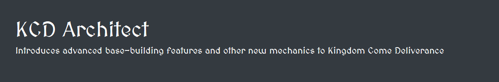

  

# KCD - Architect
 
A modification for Kingdom Come Deliverance which introduces base-building mechanics and new features to the game.

This project allows the construction of entities within the games world - 
this means that the player can spawn anything from simple props to flora & fauna, vegetation, houses, walls, towers,
tents, chairs, benches, beds, etc. anywhere in the world.

Make a backup of your saved games before doing anything else.  
Constructions are saved across your savegames - there is no new save required.  

There are _no DLCs required_ in order to use this mod.

If you're having fun with this mod you're maybe interested in buying me a coffee :)

Thanks to [Warhorse Studios](https://warhorsestudios.cz) for creating this gem!

For changelogs, planned features or in-depth details see [https://benjaminfoo.github.io/Architect/](https://benjaminfoo.github.io/Architect/)

 

## Installation
Download the latest release, unzip the archive into your KingdomComeDeliverance\mods - folder.
If the installation was succesful you'll see the instructions-message on how to use the mod when the game has been started
(and a savegame loaded or a new game hast been created).

### Using the devmode
You need to start the game with devmode enabled (the modification won't work otherwise).  
**In your OS / explorer / shell:** 
`<Steam>\steamapps\common\KingdomComeDeliverance\Bin\Win64\KingdomCome.exe -devmode`
  
### For Steam Users
The following list of files files need to be stored at: 
`Steam\steamapps\common\KingdomComeDeliverance\mods\architect\`
- mod.manifest
- keybinds.cfg
- Data\architect.pak

### For Epic Store Users
This will get updated soon - however, take a look at the posts section of this site - people using epic were also able to use this mod.

### Uninstall / Removal
Its also safe to remove the mod at any time (if you've already created something within the game, without
deleting it first, the entity stays in the game. Use **#deleteall()** within the ingame-console to clean up your scene.)

 

## Usage / Keys
These keys can be used to interact with the mod - they're also shown ingame.

Choose the next construction
Button MouseWheel up  

Choose the previous construction
Button MouseWheel down  

Create a new construction  
Key V

Toggle rotation-mode for new construction
Key R
                
Remove a construction  
Key G

Toggle deletion lock  
Key O

Enable / Disable the modification  
Key H

 

For changelogs, planned features or in-depth details see [https://benjaminfoo.github.io/Architect/](https://benjaminfoo.github.io/Architect/)

## Usage

### Console commands
The following list contains regular console commands

- architect_help - shows the available console- & lua- commands 
- architect_clear - clear the ingame console
- architect_gamble - win or loose 5 groschen!
- architect_eval - eval some string of lua
- architect_log, log - print some text to the ingame-console
- architect_recompileAll - reload the source-code of the project

 

##### How-to: Change default key-bindings
The `keybinds.cfg` file contains all keybindings used in the project - change it to a key or a controller button as you like.

 

## Thanks / Credits
Thanks to [Warhorse Studios](https://warhorsestudios.cz) for creating such a great game, with engine, assets & sdk -
this fun project wouldnt be possible without you.

Also big thanks to the modding community on nexus.

Thanks @sexybiscuit for creating the great video on how to use and install the modification!
